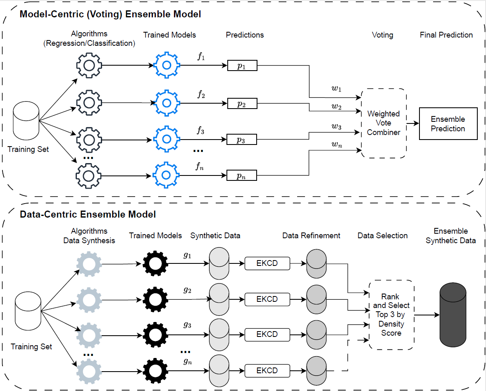

# Blending Is All You Need: Data-Centric Ensemble Synthetic Data
#### Alex X. Wang, Colin R. Simpson, and Binh P. Nguyen(https://people.wgtn.ac.nz/b.nguyen) ∗

## Abstract
Deep generative models are increasingly used in natural language processing and computer vision, and efforts are being made to apply them to tabular data. Although these models can generate synthetic data, they often require significant computational resources and precise tuning. This study examines whether combining synthetic data from multiple smaller models can perform as well as or better than a single large model. We created a Data-Centric Ensemble Synthetic Data model using ensemble learning techniques. We refined the synthetic datasets by removing noise, ranking, selecting, and combining them to improve quality and quantity. We introduced the Ensemble $k$-Nearest Neighbors with Centroid Displacement (EKCD) algorithm for noise filtering and used a density score for data ranking and selection. Our results show that EKCD effectively removes noisy samples and that the refined synthetic data ensemble significantly enhances machine learning model performance, sometimes even outperforming real data.



## Availability and implementation
Source code and data are available at [GitHub](https://github.com/coksvictoria/IDI_TabularDataSynthesis/)

### High-Level steps
+ Step 1. Get Data:
00GetData.ipynb
  
+ Step 2. Data Generation using multiple Baseline Models:
01BaselineSynthesis.py

+ Step 3. Data Refinement and Combination:
02Ensemble_Evaluation.ipynb

## Contact 
[Go to contact information](https://homepages.ecs.vuw.ac.nz/~nguyenb5/contact.html)

## Reference
We appreciate your citations if you find this repository useful to your research!
```
TBA
```
